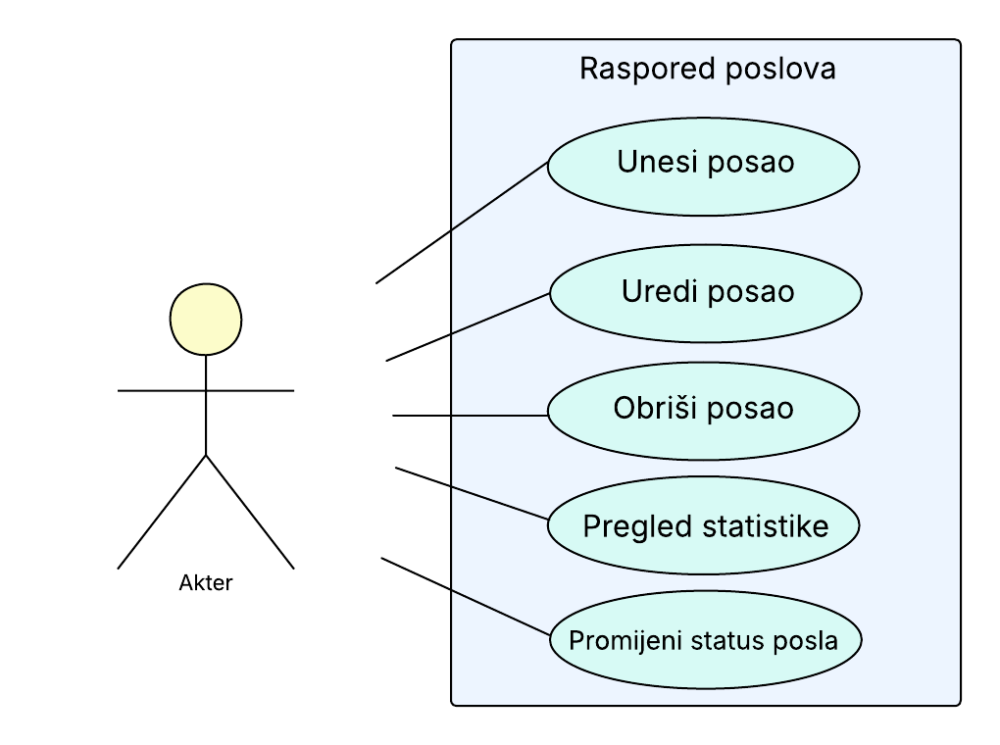

# Projekt_Raspored_poslova

## Opis funkcionalnosti aplikacije  

Aplikacija omogućuje praćenje rasporeda poslova za tvrtku koja se bavi instaliranjem klimatizacijskih uređaja.  
  
Funkcionalnosti:  
1. pregled svih poslova (Read)
2. add_job - dodavanje novog ugovorenog posla u tablicu s detaljima o adresi na koju se uređaj treba instalirati/servisirati, datumu i vremenu u koje se posao treba doći obaviti, tip uređaja koji se mora donijeti, koji radnik obavlja instalaciju, ukupna cijena za dogovorenu instalaciju, te oznaka je li posao obavljen ili nije. (create)
3. edit_job - u slučaju da dođe do izmjene ugovorenih detalja s klijentima, uređivanje već dodanog posla (update)
4. gumb obriši - ako je dokazani posao otkazan, ovime se uklanja iz rasporeda (delete)
5. statistika - prikaz broja obavljenih/neobavljenih poslova, ukupne zarade, pretraga poslova po radniku ili po datumu (read)
  
  
Posao(id, adresa, datum, vrijeme, klima, radnik, cijena, obavljeno)

## UseCase dijagram
  

  

## Kako pokrenuti aplikaciju
  
1. Provjerite imate li instaliran Docker na svom računalu.
2. klonirajte repozitorij:
git clone https://github.com/istevanja-debug/Projekt_Raspored_poslova
cd (pocetni dir)
3. 
  
## Tehnologije korištene u izradi projekta
  
1. Backend ()
2. Frontend (HTML, CSS, Bootstrap)
3. GitHub
4. PyCharm, Docker

# Autorica: Ivona Papa, JMBAG 00700543245 